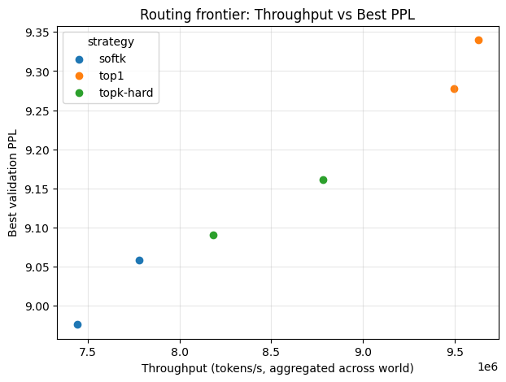
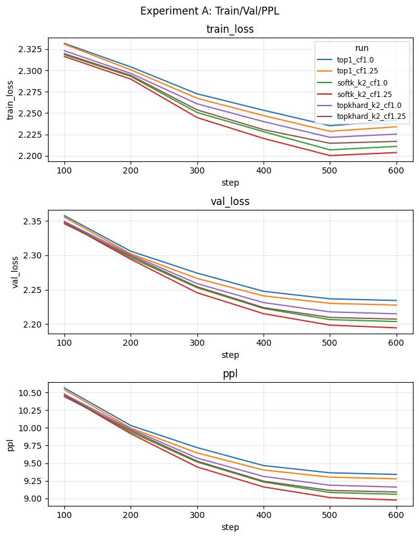
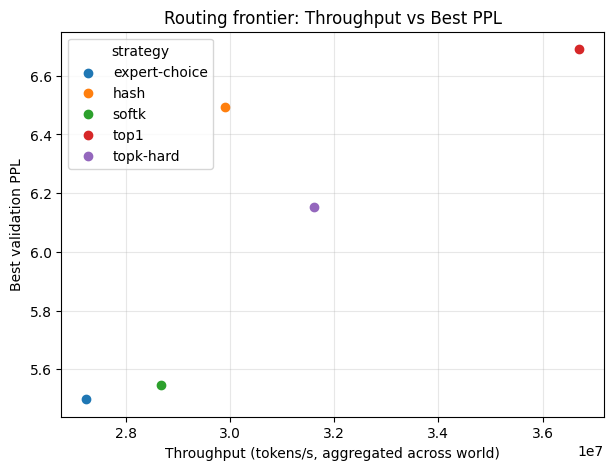
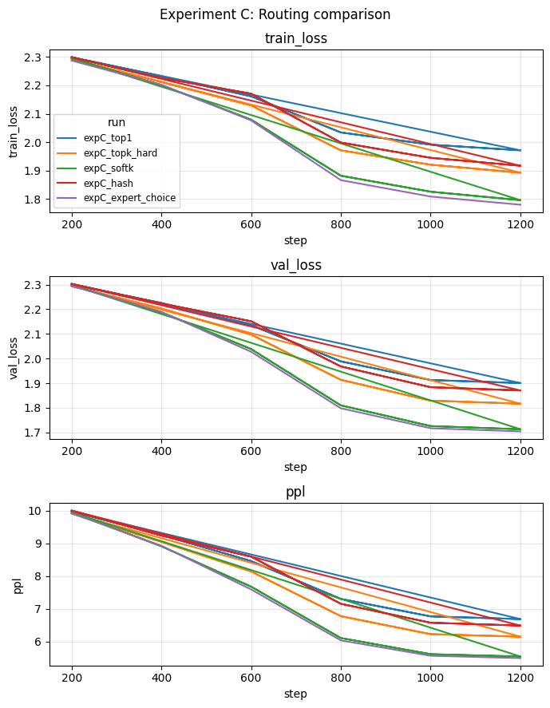

# MoE Routing Bench – Report

## Abstract
We study small-scale MoE routing trade-offs (top1, topk-hard, softk) and extend them with hash and expert-choice routers. Using a TinyMoE Transformer, we benchmark perplexity, throughput, drop rate, load balance, and gate entropy under varying capacity factors. New scripts reproduce routing frontiers, capacity sweeps, and multi-router comparisons; findings inform routed PEFT and system support (vLLM MoE+LoRA).

## 1. Introduction & Scope
- Goal: quantify routing/capacity trade-offs on a controllable MoE; connect to parameter-efficient and dynamic routing trends (Switch/Soft-MoE/Chain-of-Experts/PERFT).
- Contribution summary:
  - Implemented new routers: content-agnostic hash and simplified expert-choice (expert-first selection) alongside top1/topk-hard/softk.
  - Ran three experiments: routing frontiers (A), capacity sweeps (B), and extended router comparison (C).
  - Produced scripts, plots, and tests for end-to-end reproducibility.

## 2. Methods
- Model: TinyMoEModel (Transformer blocks + MoEFeedForward), bf16, seq_len 256–512, batch 32 (scales in DDP).
- Routing strategies:
  - hard: top1, topk-hard.
  - soft: softk (soft top-k, optional renorm_after_drop).
  - hash (new): token hash → fixed experts, uniform gates; perfect balance but content-agnostic.
  - expert_choice (new): experts pick top tokens; tokens keep up to top_k experts ranked by logits; uses torch_soft pack/combine.
- Capacity: capacity_factor × expected load (T·K/E); metrics: drop_rate, token_drop_rate, load_cv, gate_entropy, used_capacity, tokens/s, eff_tflops, bw_GiBps.
- Tests: routing equivalence for hash/EC; DDP smoke tests.

## 3. Experiments & Repro
- Experiment A (top1/topk-hard/softk × CF 1.0/1.25):  
  `GPU_IDS=0,1,2,3 bash scripts/run_experiment_a.sh` → `bash scripts/summarize_plot_experiment_a.sh`
- Experiment B (capacity sweep E∈{64,128,256}, K∈{1,2,4}, CF=0.9..1.5):  
  `bash scripts/run_and_plot_experiment_b.sh`
- Experiment C (top1/topk-hard/softk/hash/expert_choice, CF=1.25):  
  `GPU_IDS=0,1,2,3 MAX_STEPS=1200 EVAL_INTERVAL=200 bash scripts/run_experiment_c.sh` → `bash scripts/summarize_plot_experiment_c.sh`

## 4. Results & Findings
- Routing Pareto (A): softk attains best PPL with ~20–25% lower tokens/s vs top1; topk-hard in between. CF=1.25 helps PPL with negligible throughput loss.
- Capacity knob (B): CF 1.05–1.10 collapses drop_rate (~1–10% → ~0) across all E,K with <1–2% throughput impact; CF>1.25 yields diminishing returns.
- Static vs learned (C): hash gives drop=0/load_cv=0 and good tokens/s but worse PPL → balance ≠ quality; content-aware routing is necessary.
- Expert Choice (C): PPL close to softk while maintaining low drop_rate/load_cv; throughput similar to softk (slower than top1/hard).
- Throughput ordering: K dominates cost (K=1 > K=2 > K=4); expert count has minor effect relative to K/hidden in pack/combine.
- Stability: softk/EC show lower load_cv and non-zero gate entropy; hard routes have gate_entropy=0 with higher drop/load_cv; hash has uniform gates.

### Quantitative highlights
- Experiment A (E=8, K=1/2, CF=1.0/1.25, 4×GPU): best PPL softk CF1.25 ≈8.98 (softk CF1.0 ≈9.06); topk-hard CF1.25 ≈9.09; top1 CF1.25 ≈9.28. Throughput: top1 ≈9.5M > topk-hard ≈8.2–8.8M > softk ≈7.4–7.8M tokens/s. Drop/load: CF1.25 cuts drop_rate (softk 0.04, topk-hard 0.17, top1 0.26) vs CF1.0 (softk 0.10, topk-hard 0.28, top1 0.36); load_cv softk ~0.16–0.29 vs top1 ~0.58–0.61.
- Experiment B (E∈{64,128,256}, K∈{1,2,4}, CF 0.9..1.5): CF=0.9 → drop up to ~10%; CF 1.05–1.10 → drop ≈0 for all lines; CF>1.25 yields no extra gain. Tokens/s flat vs CF; main driver is K (K=1 ~5.6M, K=2 ~3.2M, K=4 ~1.7–1.8M); expert count causes minor variation.
- Experiment C (E=8, K=2, CF=1.25, 4×GPU): best PPL ordering: expert_choice 5.50 ≈ softk 5.55 < topk-hard 6.15 < hash 6.49 < top1 6.69. Throughput ordering: top1 36.7M > topk-hard 31.6M > hash 29.9M > softk 28.7M > expert_choice 27.2M. Drop/load: hash drop=0/load_cv=0; softk/EC drop≈0.04–0.06, load_cv≈0.30; topk-hard drop≈0.16, load_cv≈0.49; top1 drop≈0.25, load_cv≈0.60.

## 5. Figures (results/)
- A: `experiment_a_frontier.png`, `experiment_a_frontier_tflops.png`, `experiment_a_overlay.png`.
- B: `capacity_drop_rate_multi.png`, `capacity_tokens_per_s_multi.png`.
- C: `expC_frontier.png`, `expC_frontier_tflops.png`, `expC_overlay.png`.

### Previews

## 6. Related Work & Discussion
- Learned routing: Sparsely-Gated MoE, Switch/Soft-MoE, Chain-of-Experts.
- Expert Choice (2202.09368): expert-first selection; our simplified EC mirrors its load-balance benefits.
- Static routing: hash/sinkhorn (Cerebras router guide); hash used here as a “balance but low-quality” baseline.
- Routed PEFT: PERFT (2411.08212) and vLLM MoE+LoRA—balanced/stable routing (softk/EC) could pair naturally with routed adapters for fine-tuning/serving.

## 7. Next Steps
- Finalize paper in ICML/NeurIPS template (integrate figures and text above).
- Slides (8–12 pages): motivation; related-work map; MoE Routing Bench overview; A frontier+overlay; B capacity curves; C frontier (hash/EC); routed PEFT/vLLM MoE+LoRA concept; takeaways.
