# Slides Outline

## Page 1 – Title
- **Title:** MoE Routing Bench: Routing Design, Trade-offs, and PERFT Insights
- **Subtitle:** Capacity factor, routing frontiers, and routed adapters
- **Authors:** Yuning Xia (yx87), Daniel Zhang (dfz1), Shaoyang Zhang (sz121), Richard Xu (rgx1)
- **Course:** COMP 414/514 – Topic 2: Mixture-of-Experts and Learning to Specialize

## Page 2 – Motivation: The Routing Bottleneck
- **Title:** The Routing Bottleneck: Why MoE Performance is a Balancing Act
- MoE scales model capacity efficiently, but its effectiveness hinges on the routing algorithm. Poor routing creates a cascade of problems:
  - **Load Imbalance**: Some experts are overworked while others are idle, leading to inefficient hardware use and potential routing collapse.
  - **Token Dropping**: When expert capacity is exceeded, tokens are discarded, resulting in direct information loss and degraded model quality.
  - **Training Instability**: The discrete, non-differentiable nature of hard routing decisions complicates optimization and can hinder convergence.
  - **Suboptimal Specialization**: Without effective routing, experts may fail to develop distinct, meaningful functions, negating the primary benefit of the MoE architecture.

## Page 3 – MoE Evolution Timeline
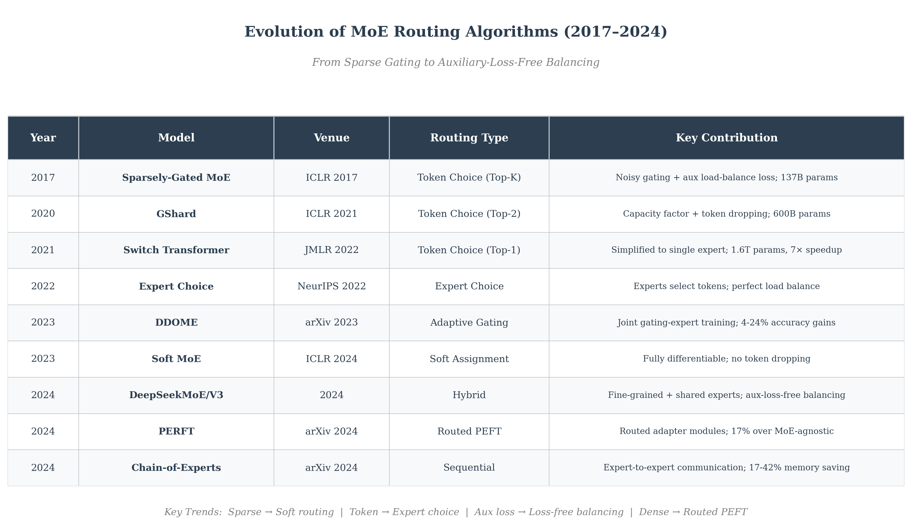
- **Timeline**: Key papers from 2017–2024 covering MoE routing evolution.
- **Core papers**: Sparsely-Gated MoE (2017), Soft MoE, PERFT, Chain-of-Experts.
- **Milestones**: GShard (capacity factor), Switch (top-1), Expert Choice, DeepSeekMoE/V3 (aux-loss-free).
- **Key trends**: Sparse→Soft | Token→Expert choice | Aux loss→Loss-free | Dense→Routed PEFT.

## Page 4 – MoE Architecture
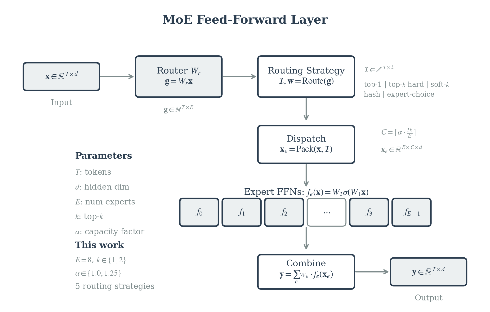
- **Router Network** (also called Gating Network): learnable layer W_r that maps tokens to expert scores.
- **MoE Forward Flow**:
  1. **Router**: W_r produces gating logits g ∈ ℝ^{T×E}
  2. **Top-k Selection**: yields indices I and weights w
  3. **Dispatch (Pack)**: tokens → expert buffers x_e ∈ ℝ^{E×C×d}
  4. **Expert FFN**: each expert processes its assigned tokens
  5. **Combine**: reconstructs output using weights w
- This work: E=8, k∈{1,2}, capacity factor (CF)∈{1.0,1.25}, 5 routing strategies.

## Page 5 – Routing Strategies Comparison
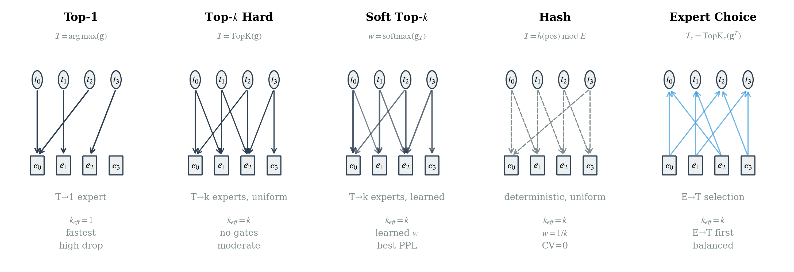
- **Top-1**: T→1 expert (argmax); fastest, high drop rate.
- **Top-k Hard**: T→k experts, uniform weights; moderate speed/quality.
- **Soft Top-k**: T→k experts, softmax weights (from learned router); best/tied PPL.
- **Hash**: Deterministic position-based; CV=0 but worst quality.
- **Expert Choice**: Experts select top tokens; good balance + best/tied PPL.

## Page 6 – Token Dropping Mechanism
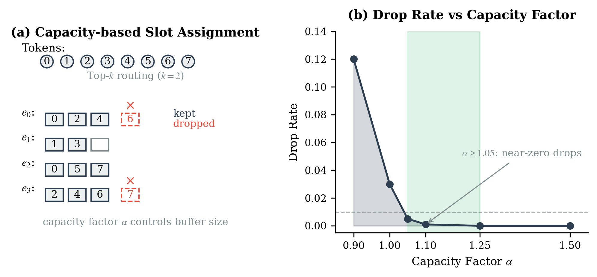
- **(a)** Capacity-based slot assignment: tokens exceeding expert capacity C are dropped.
- **(b)** Drop rate vs capacity factor: CF ≥ 1.05 achieves near-zero drops.
- Practical default: CF ≈ 1.1–1.25 eliminates drops with <2% memory overhead (also confirmed in Switch Transformer, Fedus et al. 2021).

## Page 7 – Bench Setup
- **Model**: TinyMoE (E=8, dim=256, L=4, K=2); larger scale E=32 (dim=512)
- **Data**: TinyStories (char + BPE); PERFT uses commonsense_170k QA
- **Hardware**: 4× L40S (BF16), DDP; 500–2000 steps
- **Metrics**: PPL, tokens/s, drop_rate, load_cv, gate_entropy
- **Reproducibility**: All configs and commands available in repo

## Page 8 – Capacity Factor Sweep
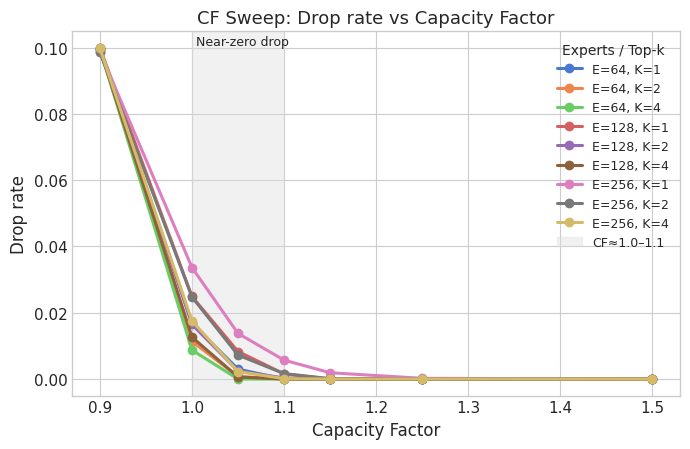
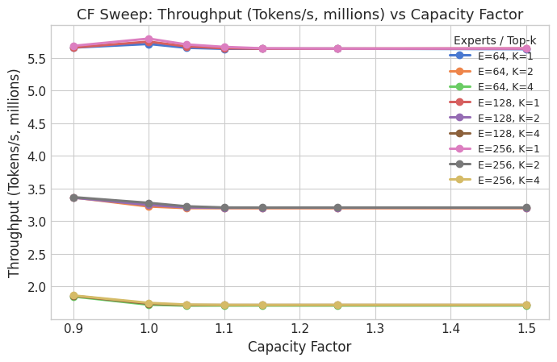
- **Experiment**: Pack/combine microbenchmark; E∈{64,128,256}, K∈{1,2,4}, CF∈{0.9–1.5}; 200 iters each.
- Takeaways:
  - CF 1.05–1.10 ≈ zero drops; throughput change <2%.
  - Confirms practical sweet spot: CF ≈ 1.1–1.25.
  - CF controls capacity/dropping; routing quality depends on strategy choice.

## Page 9 – Unified Router Frontier (E=8)
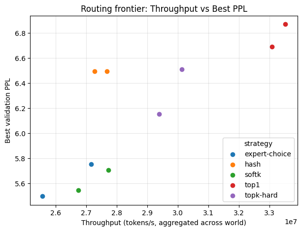
- **Experiment**: End-to-end training on TinyStories (char); E=8, K=2, CF∈{1.0,1.25}; 1200 steps; 4×L40S DDP.
- Takeaways:
  - Perplexity ranking (lower is better): expert_choice ≈ softk < hash < topk-hard < top1.
  - Speed: top1 fastest; softk/EC ~20–25% slower.
  - Hash: perfect balance, worst perplexity → balance alone is insufficient.

## Page 10 – Unified Convergence (E=8, CF=1.25)
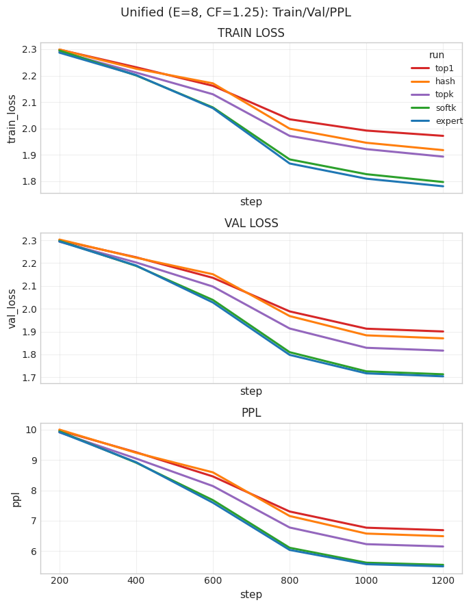
- **Experiment**: Training curves from unified sweep; E=8, K=2, CF=1.25; 1200 steps; 5 strategies.
- Takeaways:
  - SoftK/EC: converge fastest, lowest perplexity (best quality)
  - Top-k Hard/Hash: mid-tier convergence
  - Top-1: slowest convergence, highest perplexity (fastest throughput but worst quality)

## Page 11 – Router Architecture × Strategy
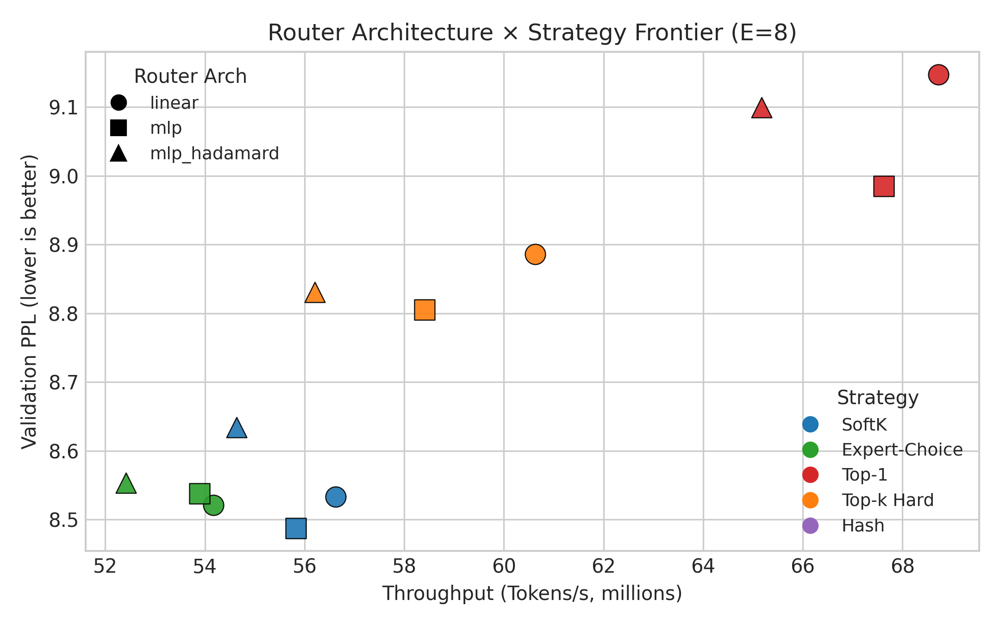
- **Experiment**: Router arch sweep; E=8, K=2, CF=1.25; router_arch∈{linear,mlp,mlp_hadamard}; 1200 steps.
- Takeaways:
  - Strategy ranking unchanged: SoftK/EC best, Top-1 fastest/worst, Top-k Hard between
  - Router architecture (linear/mlp/mlp_hadamard) has minimal impact on perplexity/throughput
  - **Key insight**: Strategy choice matters more than router architecture

## Page 12 – Larger Scale & Subword
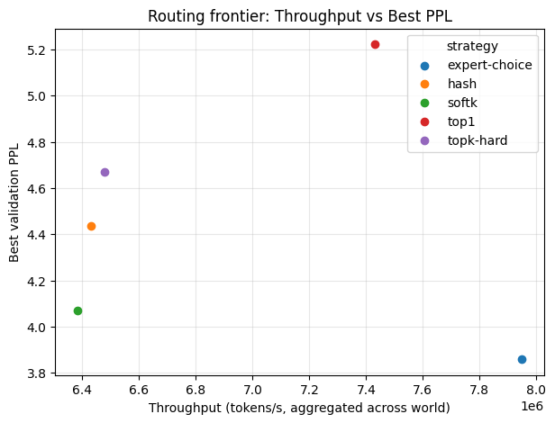
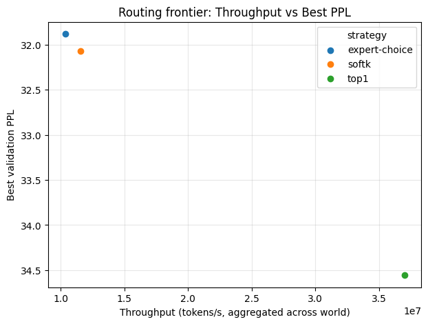
- **Experiments**:
  - Larger scale: E=32, dim=512, K=2, CF=1.5, 2000 steps
  - Subword: BPE tokenizer (gpt-neo), E=8, K=2, CF=1.25, 1200 steps
- Takeaways:
  - Strategy ranking persists at larger scale (E=32) and with BPE tokenization
  - SoftK/EC remain best quality
  - **Conclusion**: Results are not artifacts of small scale or char-level tokenization

## Page 13 – PERFT Architecture Variants
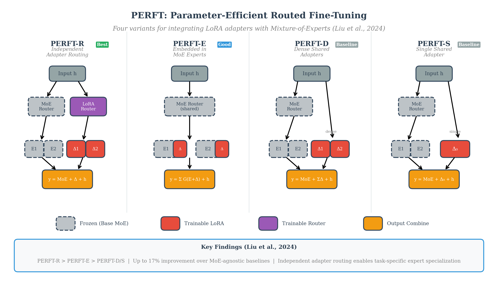
- **PERFT-R (Routed)**: Independent trainable router for LoRA adapter experts → best performance (up to 17% over MoE-agnostic).
- **PERFT-E (Embedded)**: LoRA adapters embedded in frozen MoE experts, sharing base router → good simplicity/performance trade-off.
- **PERFT-D (Dense)**: Multiple always-active adapters (no routing) → baseline approach.
- **PERFT-S (Single)**: Single shared adapter → simplest baseline.
- **Performance ranking**: PERFT-R ≥ PERFT-E > PERFT-D > PERFT-S
- **Key insight**: Independent adapter routing enables task-specific expert specialization.

## Page 14 – PERFT Frontier (Adapter Routing)
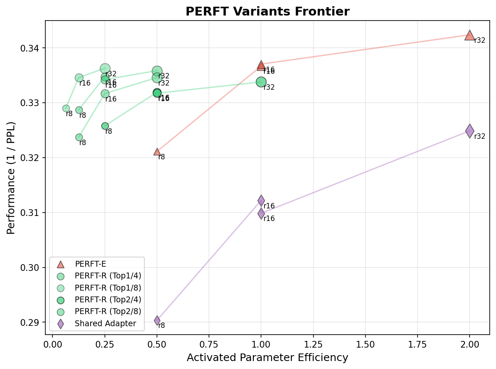
- **Experiment**: PERFT sweep on commonsense_170k QA; LoRA ranks∈{8,16,32}; TopK/N∈{(1,4),(2,4),(1,8),(2,8)}; 500 steps.
- Takeaways: PERFT-R dominates; PERFT-E > Shared; sweet spot: sparse Top1/8 or Top1/4, rank 8–16; higher rank → diminishing returns.

## Page 15 – Load Balance vs Quality
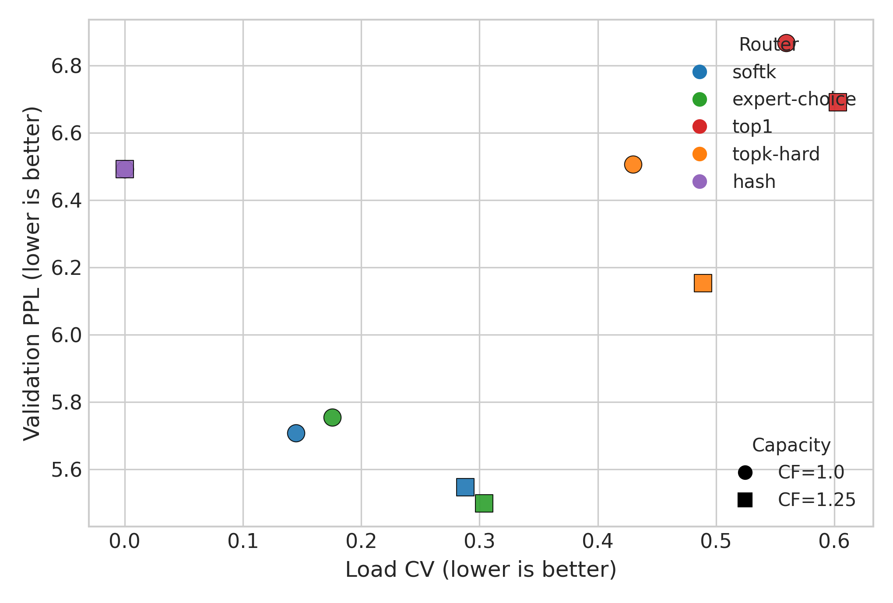
- **Experiment**: Unified sweep metrics; E=8, K=2, CF∈{1.0,1.25}; plots mean_load_cv vs best_val_ppl.
- Takeaway: Hash has perfect balance but worst perplexity; SoftK/EC moderate load_cv with best perplexity; hard routes high load_cv, worse perplexity → load balance alone ≠ quality.

## Page 16 – Expert Load Distribution
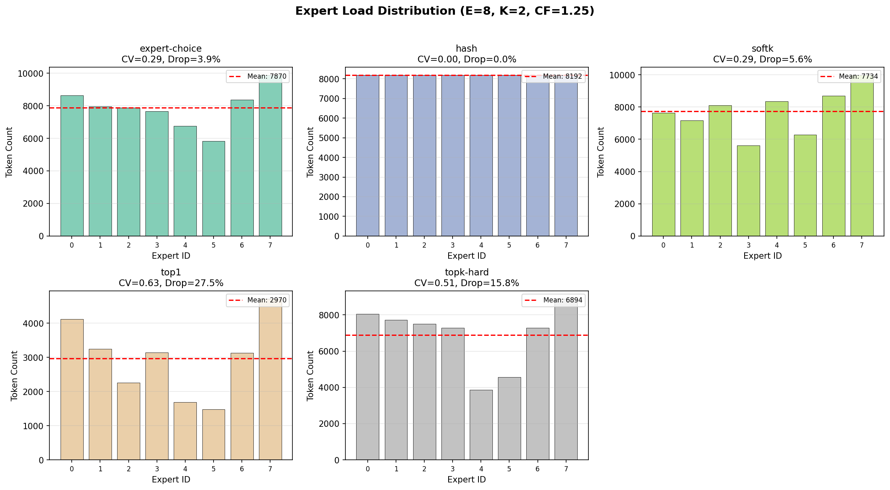
- **Experiment**: Inference on TinyStories val using trained checkpoints; E=8, K=2, CF=1.25; 20 batches.
- Takeaways:
  - **Hash**: Perfect uniform (CV=0.00, Drop=0%) – validates as load-balance baseline
  - **Top-1**: Severe imbalance (CV=0.63, Drop=27.5%) – experts 0,7 get 2.5× more than experts 4,5
  - **Soft routing** (EC, softk): Moderate balance (CV≈0.29, Drop=4-6%) – best quality-balance trade-off
  - High CV correlates with high drop rate → imbalance causes capacity overflow

## Page 17 – Token-Expert Routing Patterns
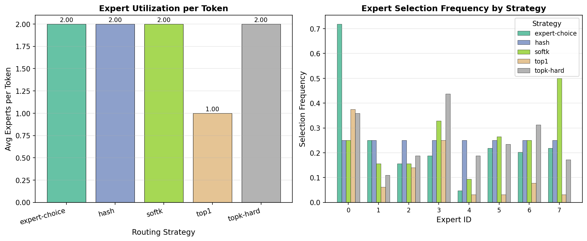
- **Experiment**: Inference on TinyStories val using trained checkpoints; E=8, K=2, CF=1.25; 64 tokens.
- Takeaways:
  - Hash: Uniform ~25% per expert (no content preference)
  - Expert-choice: Extreme expert-0 preference (~70%) – learned specialization
  - Top-1/topk-hard: Concentrated on few experts → imbalance source

## Page 18 – Token-Expert Routing Heatmaps
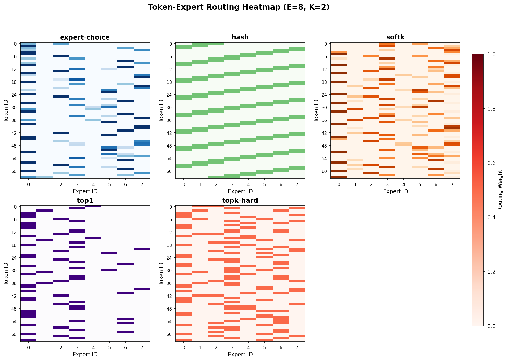
- **Experiment**: Inference on TinyStories val using trained checkpoints; E=8, K=2, CF=1.25; 64 tokens × 8 experts.
- Takeaways:
  - **Hash**: Diagonal stripe pattern → deterministic position-based cycling (content-agnostic)
  - **Top-1**: Sparse single cells → extreme specialization
  - **Soft routes**: Weight gradients (intensity variation) → learned probabilistic assignment
  - Visual proof: Hash ignores content; learned routes show vertical/horizontal structure

## Page 19 – Annotated Pareto Frontier
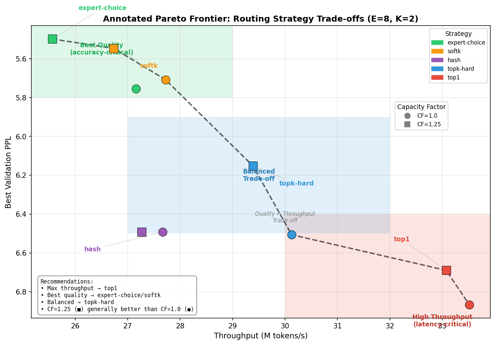
- **Experiment**: Unified sweep summary; E=8, K=2, CF∈{1.0,1.25}; 5 strategies; annotated with operating regimes.
- Takeaways:
  - **Best Quality** (green): expert-choice/softk (CF=1.25) → perplexity 5.50-5.55, ~25-26M tok/s
  - **Balanced** (blue): topk-hard → perplexity 6.15, ~30M tok/s
  - **High Throughput** (red): top1 → perplexity 6.69-6.87, ~33-34M tok/s (fastest, worst quality)
  - CF=1.25 (■) beats CF=1.0 (●) across all strategies
  - Hash off-frontier → content-agnostic routing never optimal

## Page 20 – Expert Specialization by Character Type
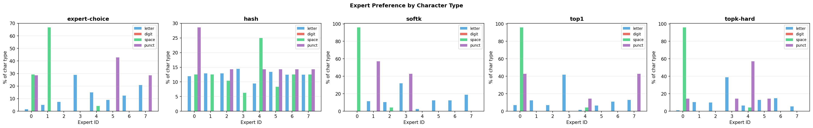
- **Experiment**: Inference on TinyStories val using trained checkpoints; E=8, K=2, CF=1.25; 256 chars.
- Takeaways:
  - **Hash**: Uniform ~12-15% per expert for all char types → confirms content-agnostic baseline
  - **Learned routing**: Spaces → single expert (~95% to Expert 0 for softk/top1/topk-hard, ~70% to Expert 1 for EC)
  - **Punctuation** also clusters (Experts 0, 7)
  - **Letters** spread across multiple experts but with preferences
  - **Key insight**: Routing specializes by **syntactic role** (space/punct vs letter), not semantic content
  - Aligns with Mixtral paper: expert assignment correlates with syntax, not topic

## Page 21 – Token Routing Colored Visualization
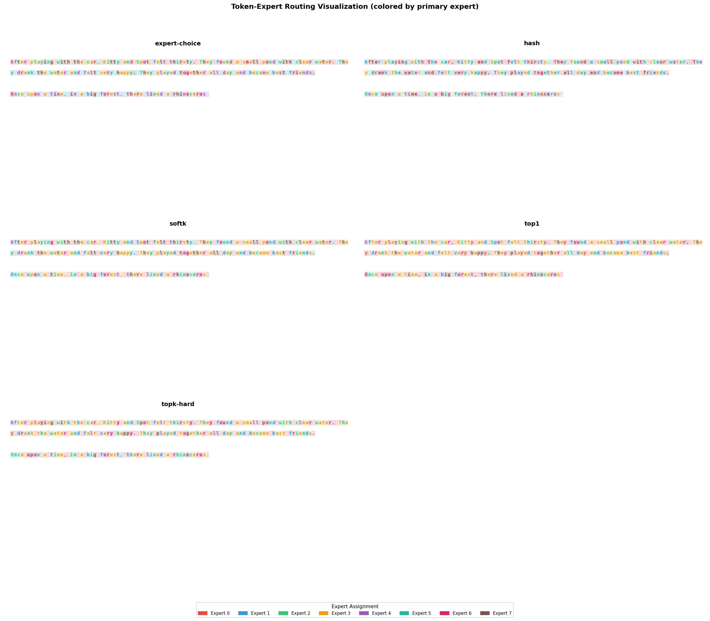
- **Experiment**: Inference on TinyStories val using trained checkpoints; E=8, K=2, CF=1.25; 256 chars colored by primary expert.
- Takeaways:
  - **Hash**: Periodic color pattern (red→blue→green→...) confirms position-based cycling
  - **Learned strategies**: Irregular patterns with clustering (spaces same color, punct similar)
  - All learned routes look similar → converge to similar solutions at small scale
  - Visual proof: Hash ignores content; learned routes show structure-aware patterns

## Page 22 – Implications (Systems / PERFT / Serving)
- MoE systems: use softk/EC for quality; CF≈1.1–1.25 to remove drops "for free"; hash not a quality fix.
- PERFT/routed PEFT: prefer routed (R/E) over shared; balanced routing keeps adapters trained.
- Serving (vLLM/Mixtral-style): top-2/soft routing + tuned CF for quality/latency balance.

## Page 23 – Conclusion & Next Steps
- Routing ranking stable across CF, scale (E=8→32), tokenizer (char→BPE); CF sweet spot identified.
- PERFT frontier matches paper trend (R > E > Shared) even in short runs (qualitative).
- Next: parallel K=2 vs sequential CoE; deeper BPE runs; plug into serving stack; explore aux-loss-free balancing.

## Page 24 – Thank You

Explore the benchmark and full report: github.com/yuninxia/moe-routing-bench
